# Setup the system
I use an Intel NUC as my device setting upp the system.
## Hardware
- Intel NUC with at least 8 Gig memory plus VM mem size, I use 32 Gig but 16 would be enough
- Make sure you have enough harddrive space. I use 256 gig SSD.
- Bios boot and hit F2 (NUC) to enter. Look for boot order and boot devices. Make sure USB boot is prio. Make sure you enabled virtualization features of the processor. 
## Prepare install
- Download the proxmox image at [this site](https://www.proxmox.com/en/downloads/category/iso-images-pve)
- Get a USB stick with at least 1 gig memory 
- Prepare the stick, I used [rufus download](https://rufus.ie/)
- Use the settings like below, specifically I used the DD mode (not ISO) to make the usb boot.

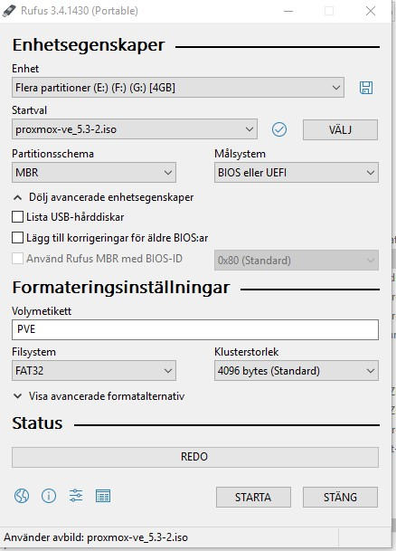

Set the DD setting (Pardon the Swedish) and press OK.
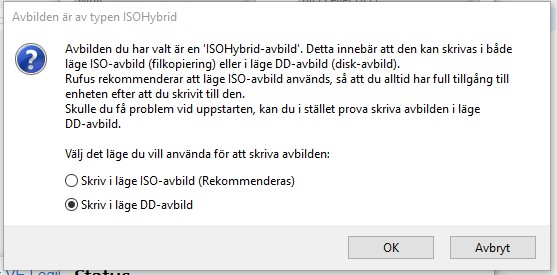
## Install
- Put the usb in the NUC and reboot. Make sure you made hardware and bios correctly
- Set the admin/root password (DONT LOSE IT!)
- Choose harddrive where you install proxmox on
- Select correct country, keyboard layout and time-zone
- Install and reboot after install is done
- Test install by login to proxmox web interface wich are https://yourip:8006. Login with root/yourpassword
## Configure before creating first VM
### Add the No-Subscription Repository
In order to get new images you need a repository. Give you have no subscription we have to add the correct repository. Add the pev-no-sybscription between the main contrib and security updates in the file:

`/etc/apt/sources.list`
```
deb http://ftp.debian.org/debian stretch main contrib

# PVE pve-no-subscription repository provided by proxmox.com,
# NOT recommended for production use
deb http://download.proxmox.com/debian/pve stretch pve-no-subscription

# security updates
deb http://security.debian.org stretch/updates main contrib
```
### Remove the enterprise subscription
Comment out the line `deb https://enterprise.proxmox.com/debian/pve stretch pve-enterprise` in the file `/etc/apt/sources.list.d/pve-enterprise.list` if you are not planning to get a subscription or you will get errors on `apt-get update`.

### Network
For home users the default bridged network makes most sense so not extra network is configured. Multiple bridges can be created. For improved security, vlans can be setup. I might do this in a test environmet but will not use VLAN for now.

### Certificates
I will use lets encrypt for certificate management. 
Todo: document this

## Add VM for Hassio
Creating the virtual machine. Default values apply if not specified in the instructions or on image.

### Upload the ISO
Download debian or what ever operating system you prefere. I use net install image of Debian 9. [download here](https://www.debian.org/CD/netinst/). Select amd64 CD or torrent if you prefer.

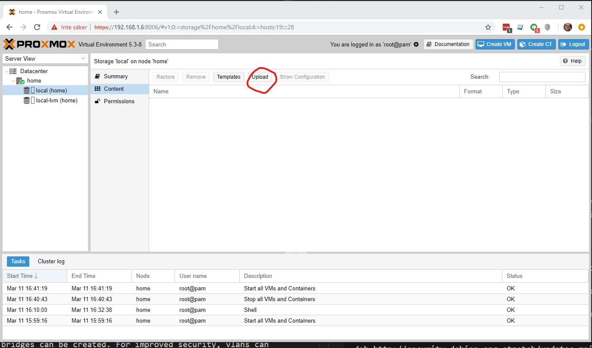

Then select your ISO file and press `Upload`

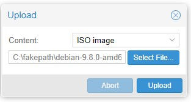

### Add the VM
**General**
- Name: HASSIO
- No resource pool

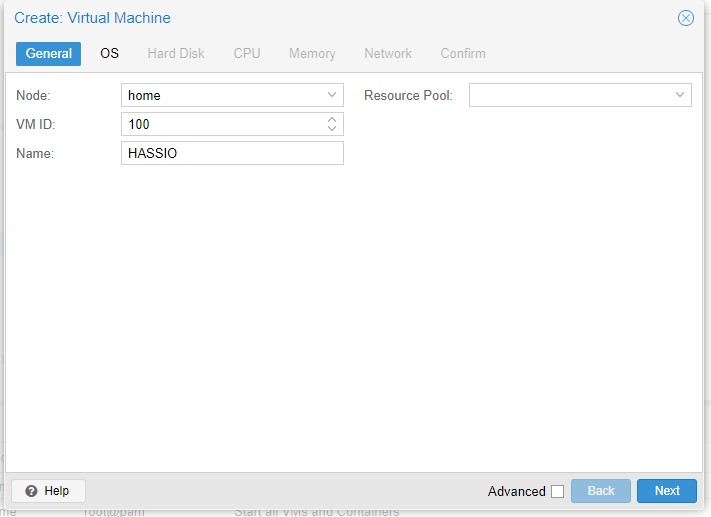

**OS**
- select your isofile and use rest default

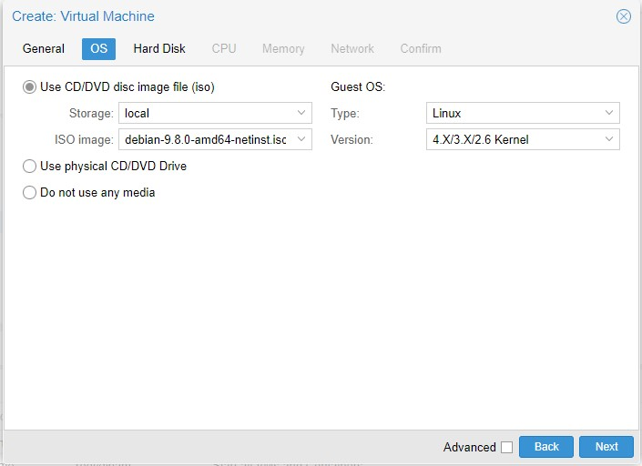

**Hard disk**
I used 20 Gig as start disk, remember that the whole disk wont be allocated at once. This is the max size.

**CPU**
- 1 socket, 2 cores should be sufficent (I have 4 cores total)

**Memory**
- 2368 MiB should be sufficient for HASSIO and docker containers

**Network**

Default settings

Create the VM by select the start the installation after created checkbox and press "Finish"

### Setup Debian
#### Installation
For other operating systems please see other.
- double click on new host to get to screen
- Install Debian with default settings. I used swedish as language and sweden as location 
- Choose host name, I use hassio
- Set the root password
- Set the non root name and username 
- Use whole disk and standard settings for partitioning
- Use standard settings util you are at the software selection
- Unselect debian environment and print server
- Select "SSH" server, I am sure you want to connect remote to the machine
- Install rest as default and reboot

Screens from setup. (Sorry for Swedish):

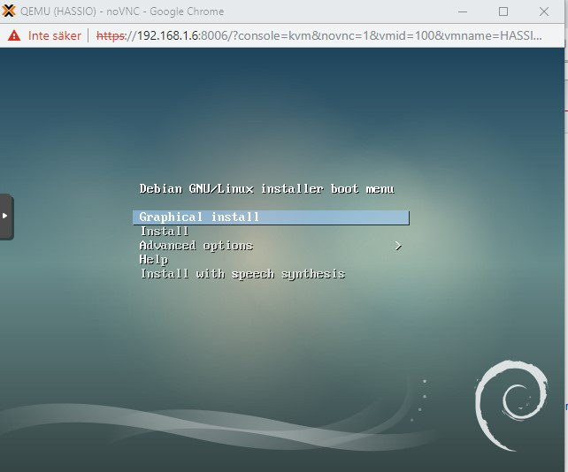
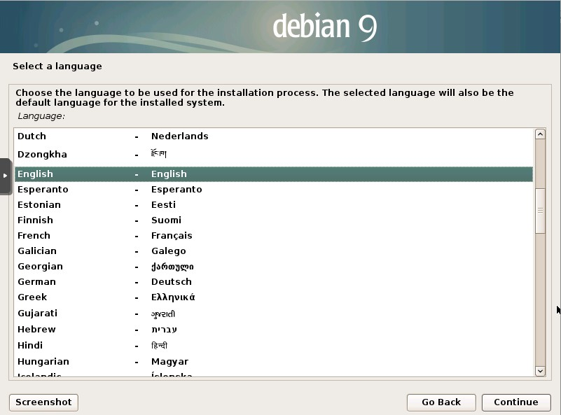
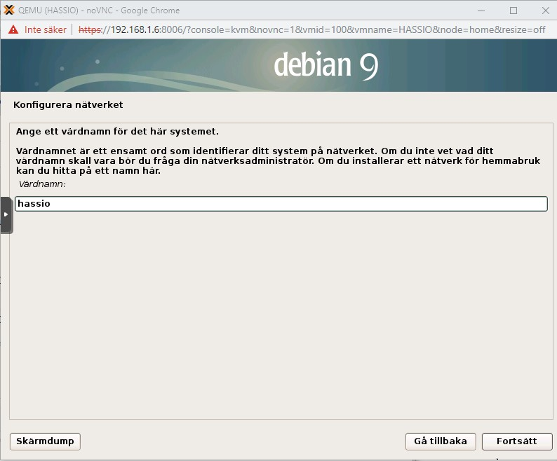
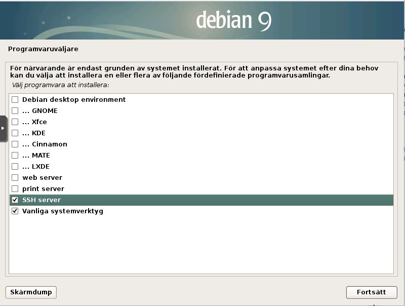


#### Install sudo
Depending on your configuration you might need to install sudo.

Enter su using `$ su` and enter password.
Install sudo and add your user (the one you provided in installtime) and exit from su.
```
$ apt-get install sudo
$ adduser username sudo
$ usermod -aG sudo youruser
$ exit
``` 
and the exit. 
Now you can use sudo for admin. 

if you get problems you might need to add the user in the sudoers file.

```
$ su
$ nano /etc/sudoers
$ exit
``` 
put the `youruser   ALL=(ALL:ALL) ALL` after root

#### IP configuration
If you want the default DHCP IP just skip this step

```
# Log in as root or su to root then
nano /etc/network/interfaces
# Should look like this:
source /etc/network/interfaces.d/*
# The loopback network interface
auto lo
iface lo inet loopback
# The primary network interface
allow-hotplug eth0
iface eth0 inet dhcp
```
then change to :

```
# The primary network interface
allow-hotplug eth0
iface eth0 inet static
        address 192.168.1.202
        netmask 255.255.255.0
        gateway 192.0.1.1
```
Make sure your settings are correct. In an VM the eth0 is probable something else. To list network interfaces write `ip link show` to get the correct one. You need to select the ethernet interface.

#### Finalizing the setup
Now it is a good time to make a snapshot. A snapshot is a point in time to restart from. 
- First make sure the latest updates and uppgrades are on the base operating syste before making snapshot.

```
$ sudo apt-get update
$ sudo apt-get upgrade
$ exit
``` 

go to the proxmox web interface and select your host ant then select "snapshot".
Create the snapshot. Call it "Fresh". Now we always can start fresh after installing hassio and all other stuff.

CONGRATULATIONS YOUR FIRST VM IS UP AND RUNNING!

# Proxmox backup
One of the best features running virtual environments is the possibility to backup entire machine really easy. Here is docs about how that's done.
## Use usb disk
### Mount the USB drive
If you are running a windows system, the drive is probably a NTFS drive. This guide assumes this but there are basically very few difference with other format types. 

For full descriptions go to [this url](https://linuxconfig.org/howto-mount-usb-drive-in-linux)

1. `$ fdisk -l` lists your disks, make sure you can see your drive. Take not of drive path i.e. `/dev/?`
2. `$ mkdir /media/usb-drive` makes mount point
3. `$ mount /dev/sdc1 /media/usb-drive/` (sdc1 will probably be another device id for you), check #1
4. `$ mount | grep sdc1`, to check if mount went ok

if you later want to unmount the usb, the command is `umount /media/usb-drive`. 

To PERMANENTLY MAKE MOUNT AVAILABLE ATT BOOT then do following. 

1. `$ blkid -t TYPE=ntfs -sUUID` Check your unique id of drive. The type can be `vfat` if not windows formatted.
2. In the file `/etc/fstab` add the following `UUID=702432D524329DD2 /media/usb-drive ntfs defaults 0 0` REMEMBER TO USER YOUR OWN UUID and other type than ntfs if your drive is formatted non ntfs! 

**Please be VERY CAREFUL to make sure everything is correct. This is why you should try mount manually first** 

### Add drive to Proxmox
1. In datacenter view, select `Storage`
2. Click, "Add->Directory" set your settings and Save

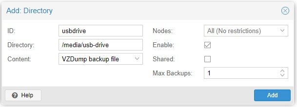

Now you can use the drive as target disk making backups in proxmox!.

## Schedule backups
1. In datacenter view, select `Backup`
2. Add a backupscheme and select your new backupdisk

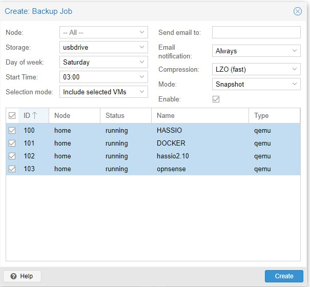

## ZFS 
I am using the system setup as NAS. 4 identical disks 2xstripe mirrored. This is at good alternative for speed and safety. Find other options for disk configurations online. I have on-line backup of my NAS this is why I dont use a "safer" configturation.

### Find the disks

`$ ls /dev/disk/by-id`

Copy the result and remove all lines with -partx. You will have the list of the unique id:s of the disks

### Create the zfs pool
First I make one mirrored with two disks.Then I make a second stripe mirrored disk. Remember to use your ID:s of the disks you got from result above. I also default use compression on the pool. 

```
$ zpool create storage -m /mnt/storage mirror ata-WDC_WD40EFRX-68N32N0_WD-WCC7K0PN86VX ata-WDC_WD40EFRX-68N32N0_WD-WCC7K1TVP925
$ zpool add storage mirror ata-WDC_WD40EFRX-68N32N0_WD-WCC7K2ES2RH7 ata-WDC_WD40EFRX-68N32N0_WD-WCC7K6CZH2D3
$ zfs set compression=on storage
$ zpool status
```

status should be something like this. 

```
  pool: storage
 state: ONLINE
  scan: none requested
config:

        NAME                                          STATE     READ WRITE CKSUM
        storage                                       ONLINE       0     0     0
          mirror-0                                    ONLINE       0     0     0
            ata-WDC_WD40EFRX-68N32N0_WD-WCC7K0PN86VX  ONLINE       0     0     0
            ata-WDC_WD40EFRX-68N32N0_WD-WCC7K1TVP925  ONLINE       0     0     0
          mirror-1                                    ONLINE       0     0     0
            ata-WDC_WD40EFRX-68N32N0_WD-WCC7K2ES2RH7  ONLINE       0     0     0
            ata-WDC_WD40EFRX-68N32N0_WD-WCC7K6CZH2D3  ONLINE       0     0     0
```

### Create more datasets

Use the zfs create command to create the datasets. Example:


`$ zfs create storage/media`

### Expose datasets trough LXC container turnkey.fileserver
I choose to expose smb/NFS through easy admin turnkey fileserver. Update and check available. Use the current version of fileserver, please check when running available command.

```
$ pveam update
$ pveam available
$ pveam download debian-9-turnkey-fileserver_15.0-1_amd64.tar.gz
```
#### Create LCX 
Create LCX container with following properties:

---------------
| Property  |  Value  |
|----------|:-------------|
| Host | fileserver (or your name)  |
| Unpriveleged | Should be "unselected"  |
| Password | passwd (your pswd)  |
| template | Name of your turnkey image downloaded    |
| memory | 800 |
| IPv4 | Select static or DHCP and your settings     |

#### Bind ZFS datatset to LCX container
Edit the `/etc/pve/lxc/100.conf` file (the 100 should be replaced with the id of your container/VM)
Add the line:
`mp0: /mnt/storage/media,mp=/mnt/storage/media`

This will bind the /mnt/storage/media dataset to a mount inside the container with the same path.

#### Configure the container (fileserver)


Follow the instructions for first time use.
1. Login using SSH using the root and password provided when you created the container. Use putty or any favourite client
2. Install

From a browser, enter configuration using 

https://ip_of_your_container:12321

Search turnkey fileserver for information about configure the smb/NFS stuff. I use `/mnt/storage/media` as smb for example since i bound the zfs dataset to it.